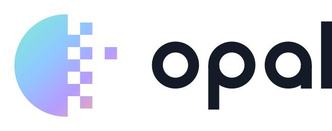
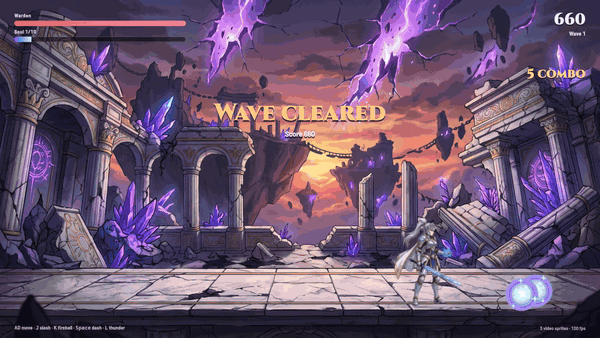
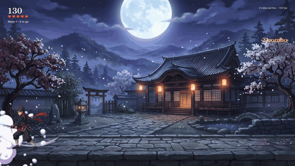

<p align="center">
  <picture>
    <source media="(prefers-color-scheme: dark)" srcset="brand/logo/opal-lockup-color-dark.svg">
    
  </picture>
</p>

<p align="center">Transparent video sprites for web games.</p>

<p align="center"><b><a href="https://dilukangelosl.github.io/opal/">Live site</a></b> · <a href="https://dilukangelosl.github.io/opal/web/game2/">Play Rift Warden</a> · <a href="https://dilukangelosl.github.io/opal/web/game/">Opal Dojo</a> · <a href="https://dilukangelosl.github.io/opal/web/tutorial/">How it was made</a> · <a href="https://dilukangelosl.github.io/opal/web/studio/">Studio</a> · <a href="docs/media/opal-dojo-trailer.mp4">Trailer</a></p>

<p align="center">
  <a href="https://dilukangelosl.github.io/opal/web/game2/"></a>
  <br><sub>Rift Warden: sword, fireballs, dash and thunder, all transparent video sprites. <a href="https://dilukangelosl.github.io/opal/web/game2/">Play it</a> · <a href="docs/media/rift-warden-gameplay.mp4">gameplay video</a></sub>
</p>

<p align="center">
  <a href="https://dilukangelosl.github.io/opal/web/game/"></a>
  <br><sub>Opal Dojo: every character and effect is a transparent video sprite. <a href="docs/media/opal-dojo-trailer.mp4">Watch the full trailer</a> · <a href="https://dilukangelosl.github.io/opal/web/game/">play it</a></sub>
</p>

Use transparent videos as game sprites. You prepare clips in **Opal Studio** (in the
browser) or with the `opal` CLI, both producing a small `.opal` file. A ~15 KB runtime
(Rust/wasm + WebCodecs + WebGL2) then plays thousands of them per frame.

## npm: `opal-sprites` (with PixiJS support)
```sh
npm i opal-sprites
```
```js
// PixiJS v8: .opal clips become normal textures for AnimatedSprite
import { loadOpal } from 'opal-sprites/pixi';
const hero = await loadOpal('warden.opal');
const s = hero.sprite('run', { anchor: hero.feetAnchor('run') });   // playing AnimatedSprite
app.stage.addChild(s);
s.textures = hero.clips.slash;                                      // switch clip, stays anchored

// or Opal's own renderer (fastest: one instanced draw per file)
import { createOpal } from 'opal-sprites';
```
The package lives in [`packages/opal-sprites`](packages/opal-sprites); [PixiJS demo](https://dilukangelosl.github.io/opal/web/pixi/).
It publishes to npm from GitHub Actions when you publish a release tagged `v<version>` (see `.github/workflows/publish.yml`).

## Rift Warden (showcase game)
`/web/game2/`: a knight-mage holds a ruined temple against skeleton warriors, rift bats and an obsidian golem boss.
Move with A/D, **J** slash, **K** fireball, **Space** dash (with afterimages), and **L** for thunder once 10 soul orbs are collected.
It uses 9 `.opal` files (391 frames, 2.6 MB): characters, a boss, portals, projectiles, pickups and effects. How the assets were made, including what failed and why: [game2/README.md](game2/README.md).

## Opal Dojo (demo game)
`/web/game/` is a small arena brawler where every character and effect is an Opal video sprite. The assets were generated with fal and packed with the CLI; see [game/README.md](game/README.md).
Controls: ← → / A D to move, Space / J to slash. On touch screens, on-screen pads appear.

## Opal Studio
`python3 -m http.server`, then open `/web/studio/`. Everything runs in the browser and
nothing is uploaded anywhere. You can:

1. **Add videos:** drop MP4, WebM or MOV. Green-screen footage and transparent WebM both work.
2. **Cut clips:** drag rectangles on the video, or use **Split into a grid** for sprite sheets. Set each clip's first and last frame from the timeline (`I` / `O`).
3. **Remove the background:** let it detect the backdrop, or pick colors with the eyedropper or a hex value. Tolerance, softness, spill and speck sliders tune the result live.
4. **Preview:** drop in a screenshot or video of your game as a reference background and size the sprite against it. *Export at preview size* bakes that size in to save download and GPU memory.
5. **Export .opal:** after export, the preview switches to the real runtime playing the exported file.

The Studio's pixel work is the same Rust code as the CLI (`crates/opal-encode`, compiled to
wasm), so both tools key, trim and pack identically. H.264 encoding uses the browser's
WebCodecs `VideoEncoder`, so no ffmpeg is needed. In the Studio, every clip gets its own
rect in one atlas and all clips share one timeline, so N clips of L frames cost only L
encoded frames.

## CLI

```
cargo build --release -p opal-cli
./target/release/opal encode -o hero.opal idle=idle.mov run=run.mov --once die die.mov
# --scale 0.5 --fps 12 shrink frames and resample time (big GPU memory savings for game sprites)

# one sheet video with all animations in a grid: name cells row-major,
# empty name = skip cell, @from-to = frame range
./target/release/opal encode -o hero.opal sheet.mov --grid 3x2 \
    --names idle,walk,run,jump,,die@0-44 --once die
# irregular layout: --rect name=x,y,w,h[@from-to] (repeatable)

# chroma key (inputs without alpha): auto-detect the backdrop, or give colors
./target/release/opal encode -o hero.opal greenscreen.mp4 --key auto --grid 3x2 --names ...
./target/release/opal encode -o hero.opal sheet.mp4 --key "#ff00ff,#e0007a" ...
# tuning: --key-tol 30 --key-soft 20 --despill 1 --despeckle 16

cargo build --release -p opal-wasm --target wasm32-unknown-unknown
cp target/wasm32-unknown-unknown/release/opal_wasm.wasm web/opal.wasm
python3 -m http.server   # open /web/compare.html (Opal vs <video>)
```

```js
import { createOpal } from './opal.js';
const opal = await createOpal(canvas);
const hero = await opal.load('hero.opal', { scale: isMobile ? 0.5 : 1 }); // 0.5 = 1/4 VRAM
const id = opal.spawn(hero, 'idle', x, y, scale);
opal.play(hero, id, 'run');
// per frame: opal.set(id, x, y, scale, opacity); opal.render(dt);
```

## Why this design

| Problem | Approach |
|---|---|
| Browsers don't agree on alpha video: VP9-alpha is Chrome/Firefox only, HEVC-alpha is Safari only, and alpha gets lost on WebGL upload | **Stacked alpha.** Color goes on top and alpha (as luma) underneath, encoded as plain H.264. Every browser has a hardware decoder for it. |
| `<video>` elements are heavy, can't seek precisely, and one per sprite doesn't scale | **WebCodecs `VideoDecoder`.** We feed chunks straight to the hardware decoder, with no demuxer and no `<video>` element. |
| Games need random frame access, many instances, and instant clip switches | **Decode once to a GPU texture array.** Video is only the download format. At runtime each sprite is a textured quad, and each asset is a single instanced draw call. |
| Edges of transparent video get dark halos from chroma subsampling | The encoder **bleeds color** into transparent pixels. Areas far from the sprite get a flat fill, which costs almost no bits. |
| Most of each frame is empty space | The encoder **trims** to the union bounding box of every frame and pads to 16 px so the color/alpha seam falls on a macroblock edge. |
| Decode order and latency | No B-frames, so decode order equals display order. There's a keyframe at every clip start. |

### Sprite sheets
Each selected cell is trimmed to its own visible area across its frame range, then shelf-packed with 4 px gutters into a single atlas. One video holds every animation, so there's one decoder and one GPU texture. The example 768×512 sheet with 5 of 6 cells selected packs into a 355×390 atlas, which is 2.8× less GPU memory than the full sheet.

### Chroma key
Keying runs once, at encode time, so it costs nothing at runtime. Open `/web/keying.html` to compare the original alpha with keyed versions on a light checker.

- **Colored keys compare chromaticity**, meaning chroma divided by brightness, so lighting falloff and shadows on the screen don't move the color. Neutral keys (black, white, grey) compare plain YCbCr.
- **`--key auto`** samples a 4-px border ring from the first, middle and last frames. It greedily picks the densest chromaticity neighborhood, up to 4 keys (for gradients and two-tone backdrops), and stops once 90% of the border is covered. It refuses when no uniform backdrop exists: the first key must cover at least 25% of the border, and all keys together at least 60%.
- **Despill** strips chroma pointing toward the key in the edge zone (tol to tol+3·soft). Lower `--despill` if real foreground colors sit near the key hue, such as red on a pink screen.
- **Cleanup:** soft clip black/white (outer 5%), then islands under `--despeckle` px are removed. Backdrop noise would otherwise survive as specks and stretch the trim box to the whole cell.
- **Physics limits:** nothing can separate a character color that matches the key, such as a green shirt on a green screen. Pick a key color the art doesn't use.

### Measured (`examples/hero_sheet.mov`, Chrome on an M-series Mac, vsync off)
| sprites | Opal fps | `<video>` WebM fps |
|---|---|---|
| 200 | 808 | 23 |
| 1,000 | 817 | 10 |
| 2,000 | 787 | never became ready |
| 20,000 | 110 | n/a |

Simulated phone (390×844, 6× CPU slowdown): Opal at ½-res runs 1,000 sprites at about 740 fps and 5,000 at about 520 fps. `<video>` runs 200 sprites at 10 fps and never becomes ready at 500.
Download size: `.opal` is 164 KB; the five per-animation WebMs total 225 KB. GPU cache is 44 MB at full resolution and 11 MB at ½-res. No decoders run after load.
GPU throttling isn't simulated, so real phones need testing. WebCodecs requires HTTPS.

**Mobile notes:** use `scale: 0.5` and keep mipmaps on (measured: without mips, minified sprites get *slower*). Cap DPR at 2. Keep the coded frame ≤ 2048 px; the encoder warns if it isn't.

## Layout
- `crates/opal-format`: the container's reader and writer, shared by every tool and the runtime. It validates untrusted input.
- `crates/opal-encode`: keying (`key.rs`), trim, atlas packing, bleed and alpha stacking, shared by the CLI and the Studio.
- `crates/opal-cli`: the `opal encode` command, which uses ffmpeg/ffprobe for decode and encode.
- `crates/opal-studio`: the Studio's wasm core (wasm-bindgen).
- `.claude/skills/opal-video-sprites/`: a Claude Code skill for generating game-ready video sprites with fal (stills → pinned loops → QA → encode), plus `tools/sprite_qa.py` (border-clipping and loop checks).
- `web/game2/`: Rift Warden. `game2/` holds its fal-generated sources and build notes.
- `web/game/`: Opal Dojo. `game/` holds its fal-generated sources and the build commands.
- `web/pixi/`: Rift Warden's assets rendered by PixiJS 8 through `opal-sprites/pixi`.
- `packages/opal-sprites`: the npm package (runtime + decoder + PixiJS adapter), synced by `build-web.sh`.
- `web/player.html`: drop any `.opal` file to play all its clips through the real runtime.
- `web/studio/`: the Studio UI. `web/compare.html` benchmarks Opal against `<video>`; `web/keying.html` previews keying.
- `brand/`: the logo (`logo/` masters, web icons and favicons) and the concept exploration.
- `build-web.sh`: rebuilds `web/opal.wasm` and `web/studio/pkg/`. The built files are committed, so the pages work without a Rust toolchain. It uses ffmpeg/ffprobe for decode and encode. Trimming, bleeding, stacking, Annex-B→AVCC conversion and packing are done in Rust.
- `crates/opal-wasm`: the runtime core. It handles parsing, sprite instances, animation and batch building, with no wasm-bindgen.
- `web/opal.js`: glue for WebCodecs decode, the stacked→RGBA blit and instanced drawing.

## `.opal` v2 (little-endian)
`"OPAL"` · u16 version (2) · u16 flags (bit0 = stacked alpha) · u16 atlas width, height, coded_w, coded_h · f32 fps ·
u8+codec string · u32+description (avcC) · u16 clip count {u8+name, u32 first, u32 count, u8 loop, u16 rect[4], u16 origin[2], u16 src[2]} ·
u32 frame count {u32 size, u8 key} · frame data (AVCC length-prefixed).

## Roadmap (not built yet)
1. **Streaming mode** for long or large clips such as cutscenes and backgrounds, where VRAM caching costs too much (w·h·4·frames). It would use one decoder with a small frame ring shared by instances.
2. **AV1 track** for files roughly 30–50% smaller. The plan is to store H.264 and AV1 in the same file and let the runtime pick with `isConfigSupported`.
3. **Native runtime** (wgpu/Bevy) on the same `opal-format` crate.
4. Smaller wasm with `no_std` and a bump allocator (likely about 3 KB), plus a VRAM budget and asset unloading.

Known limits: frames per asset ≤ `MAX_ARRAY_TEXTURE_LAYERS` (≥256, usually 2048). All clips in one file must share size and fps. Firefox Android has no WebCodecs yet.

## Brand
The mark is the O resolving into transparency pixels at its edge: what Opal does to a video. Masters are in `brand/logo/`:

| File | Use |
|---|---|
| `opal-symbol.svg` / `opal-symbol-color.svg` | The mark, in one colour or with the opal gradient |
| `opal-symbol-small.svg` | Simplified cut for 16–32 px (favicons, tabs) |
| `opal-lockup*.svg` | Mark + wordmark: black, white, colour (light bg), colour-dark (dark bg) |
| `web/` | favicon.ico/svg, app icons, webmanifest, head snippet |

Colours: ink `#141B26`. The opal gradient is `#7EF0D0` → `#8FC8FF` → `#B69CFF` → `#FFB38A`, and the one-colour accent is `#B69CFF`.
The wordmark is constructed from circles and bars, so there's no font licence to worry about. Trademark clearance hasn't been checked.
